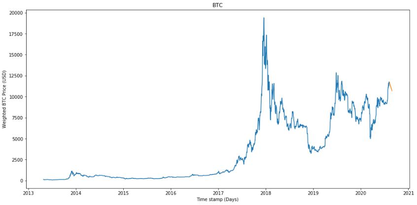

 # ML-Project-3-Bitcoin

#### Project Goal

The goal of this project was to predict bitcoin (btc) prices using RNN. 
One thing to note is that; bitcoin is known to be very manipulated so I did not expect my model to perform well. 

#### Conclusion

Built Recurrent Neural Net with LSTM cells predicted Bitcoin’s price decrease of 8% in the next 20 days from 08/08/2020, forecasted 20 days into the unknown (model performance metric is MAE: 603.5 & RMSE: 694.61)

In this project, I've built two different RNN model; 
* RNN **without** Time Series Generator
    * MAE: 4391.88
    * RMSE: 4843.59
* RNN **with** Time Series Generator
    * MAE: 603.50
    * RMSE: 694.61

The RNN model with the time series generator had better performance than the RNN model without time series generator. So I used the RNN model with the generator to forecast into the unknown.
    
By using RNN model with time series generator, as the model tries to forecast further into the future, the errors that it may picked up while trying to forecast will be magnified the further we try to forecast because the model will be forecasting the forecasted. Fortunately the testset had only 10 timestamp but, if we do decide to forecast even further, we will notice the performance drop the further we forecast.
    
Bitcoin is a very volatile and manipulated asset. Predicting bitcoin's price from past history's data might not be enough.

#### Data Source

I have created my own dataset by webscraping coinmarketcap using Selenium and <xpath>. I then created the CSV file which contains all of the lists/arrrays I scraped. I chose Selenium over faster methods such as scrapy or beautiful soup due to its capabilities in htlm interaction. I plan on making a trading bot in the future. 
  
#### Data Description

This dataset has 6 different columns, all object data types. I intend to convert them into different data types; 1 datetime and 4 float, with 2660 rows/entries. Each float data type column describes candle properties except for the 'Volume' column. 

